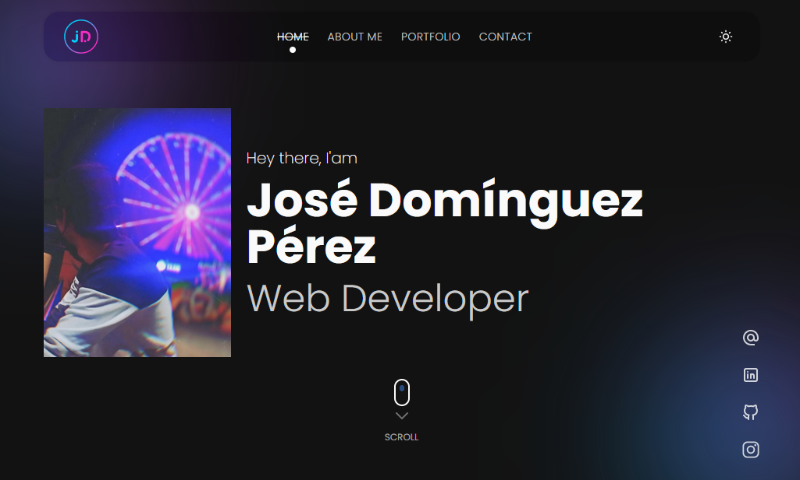

# My Personal Website 🖤

## Table of Content

- [About The Project](#about-the-project)
  - [Description](#description)
  - [Built With](#built-with)
- [Installation](#installation)
- [Usage](#usage)
- [Demo](#demo)
- [Contact](#contact)

## About The Project

<p align='center'>
  
</p>

## Description

My personal website built with NextJS, TypeScript, ChakraUI and designed with Figma.

On my website you will find a little about me and some of the projects I've worked on. 🚀

## Built With

[](https://nextjs.org)

[](https://www.typescriptlang.org)

[](https://chakra-ui.com)

[](https://www.framer.com/motion)

[](https://www.figma.com)

## Installation

1. Clone the repo and change "my-project" to your project name.

```sh
  git clone https://github.com/josemiguel02/my-personal-website.git ./my-project
```

2. Go to the project directory

```sh
  cd my-project
```

3. Install NPM packages

```sh
  yarn install
```

## Usage

Run the project in development

```npm
  yarn dev
```

Build the project

```npm
  yarn build
```

## Demo

- [View demo](https://josemidev.vercel.app)
- [Figma Design](https://www.figma.com/file/LrwKAfsw1uAcP1AFe7ok23/My-Portfolio-Design?node-id=0%3A1)

## Contact

- Gmail - [josemidev24@gmail.com](mailto:josemidev24@gmail.com)
- LinkedIn - [@josemidev24](https://www.linkedin.com/in/josemidev24)
- Instagram - [@jmdp.02](https://www.instagram.com/jmdp.02)
